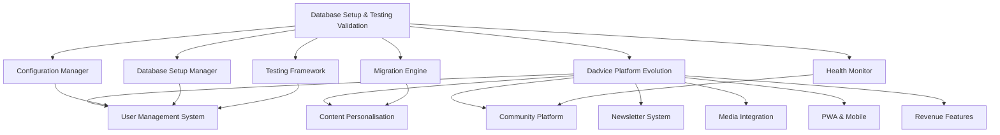

# Club Dadvice Platform Specifications

This directory contains the complete specification suite for the Club Dadvice platform evolution. The specs are designed to work together to create a comprehensive, scalable platform for modern fathers.

## Specification Overview

### 🏗️ Infrastructure Foundation
**[Database Setup & Testing Validation System](.kiro/specs/database-setup-validation/)**
- **Purpose**: Foundational infrastructure for reliable development and deployment
- **Status**: Ready for implementation
- **Priority**: CRITICAL - Must be completed first
- **Dependencies**: None
- **Enables**: All other platform features

**Key Components:**
- Automated database setup and schema management
- Comprehensive testing framework with HTML reporting
- Environment-specific configuration management
- Database migration and health monitoring systems

### 🚀 Platform Evolution
**[Dadvice Platform Evolution](.kiro/specs/dadvice-platform-evolution/)**
- **Purpose**: Transform current site into comprehensive dad community platform
- **Status**: Ready for implementation
- **Priority**: HIGH - Main feature development
- **Dependencies**: Database Setup & Testing Validation System
- **Timeline**: 28 weeks of development phases

**Key Features:**
- Enhanced content management with personalisation
- Community platform for peer support
- Newsletter system with personalised content
- Mobile app (PWA) with offline capabilities
- Podcast integration and media hub
- Revenue generation and analytics

## Implementation Strategy

### Phase 0: Infrastructure (Weeks 1-2)
**Complete First:** Database Setup & Testing Validation System
- Tasks 1-8 from database-setup-validation spec
- Establishes reliable development environment
- Enables frictionless local/production workflow

### Phase 1-7: Feature Development (Weeks 3-28)
**Then Proceed:** Dadvice Platform Evolution
- Follow tasks in dadvice-platform-evolution spec
- Use infrastructure from Phase 0 for all development
- Complete remaining infrastructure tasks (9-12) during Phase 6

## Specification Relationships

## Development Workflow

### For AI Software Engineers

1. **Start Here**: Read this README to understand the complete specification structure
2. **Infrastructure First**: Implement database-setup-validation spec completely (tasks 1-8 minimum)
3. **Feature Development**: Use dadvice-platform-evolution spec with infrastructure foundation
4. **Testing**: Use testing framework from infrastructure spec throughout development
5. **Deployment**: Use migration and health monitoring systems for production deployment

### For Human Developers

1. **Environment Setup**: Use automated setup from database-setup-validation spec
2. **Development**: Follow phase-by-phase approach in dadvice-platform-evolution spec
3. **Quality Assurance**: Use Kiro Hooks defined in dadvice-platform-evolution tasks
4. **Deployment**: Use migration tools and monitoring from infrastructure spec

## Key Benefits of This Approach

### ✅ Frictionless Development
- Automatic environment detection and configuration
- Seamless switching between local and production environments
- Comprehensive testing framework prevents regressions

### ✅ Reliable Platform
- Robust infrastructure ensures consistent performance
- Health monitoring provides proactive issue detection
- Migration system enables safe schema evolution

### ✅ Scalable Architecture
- Modular design supports incremental feature addition
- Performance monitoring ensures near-instantaneous response times
- Infrastructure supports growth across web, app, podcast, and community

### ✅ Future-Proof Foundation
- Clear specification trail for future AI SWEs
- Comprehensive documentation and testing
- Flexible architecture supports platform evolution

## Getting Started

1. **Clone Repository**: Ensure you have the complete codebase
2. **Read Infrastructure Spec**: Review `.kiro/specs/database-setup-validation/requirements.md`
3. **Set Up Environment**: Follow setup instructions in infrastructure spec
4. **Run Tests**: Use comprehensive testing system to validate setup
5. **Begin Development**: Start with Phase 1 of platform evolution spec

## Support and Documentation

- **Specifications**: All specs include detailed requirements, design, and implementation tasks
- **Testing**: Comprehensive test suite with HTML reporting
- **Monitoring**: Health monitoring and performance analytics
- **Migration**: Safe database evolution tools

This specification suite provides everything needed to transform Club Dadvice into the definitive platform for modern fathers while maintaining development velocity and platform reliability.