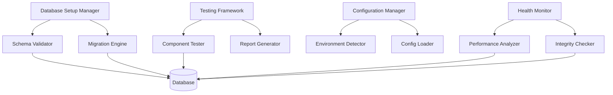

# Design Document

## Overview

The Database Setup and Testing Validation System is designed to provide a comprehensive solution for managing database initialization, schema validation, and automated testing in the Club Dadvice application. The system addresses current issues with missing database tables and provides a robust foundation for ongoing development and deployment.

The design follows a modular approach with separate components for database setup, testing validation, configuration management, and health monitoring. Each component is designed to work independently while integrating seamlessly with the overall system.

## Architecture

### System Components



### Data Flow

1. **Initialization Phase**: Configuration Manager detects environment and loads appropriate settings
2. **Setup Phase**: Database Setup Manager creates schema and populates initial data
3. **Validation Phase**: Testing Framework runs comprehensive tests across all components
4. **Monitoring Phase**: Health Monitor continuously checks database status and performance
5. **Reporting Phase**: Report Generator creates detailed status reports and recommendations

## Components and Interfaces

### 1. Database Setup Manager

**Purpose**: Handles database initialization, schema creation, and data population

**Interface**:
```php
class DatabaseSetupManager {
    public function initializeDatabase(): SetupResult
    public function createSchema(): SchemaResult
    public function populateDefaultData(): PopulationResult
    public function validateSetup(): ValidationResult
    public function generateSetupReport(): SetupReport
}
```

**Key Methods**:
- `initializeDatabase()`: Main entry point for database setup
- `createSchema()`: Creates all required tables with proper constraints
- `populateDefaultData()`: Inserts default age groups, categories, and reference data
- `validateSetup()`: Verifies all tables and data are correctly created
- `generateSetupReport()`: Produces detailed setup status report

### 2. Testing Framework

**Purpose**: Provides comprehensive testing capabilities for all application components

**Interface**:
```php
class TestingFramework {
    public function runAllTests(): TestResults
    public function testDatabaseConnectivity(): TestResult
    public function testArticleManagement(): TestResult
    public function testEmailSystem(): TestResult
    public function testSecurityFeatures(): TestResult
    public function generateTestReport(): TestReport
}
```

**Key Methods**:
- `runAllTests()`: Executes complete test suite
- `testDatabaseConnectivity()`: Validates database connection and table access
- `testArticleManagement()`: Tests CRUD operations and filtering
- `testEmailSystem()`: Validates email configuration and sending
- `testSecurityFeatures()`: Tests CSRF protection and rate limiting

### 3. Configuration Manager

**Purpose**: Manages environment-specific configuration and prevents conflicts

**Interface**:
```php
class ConfigurationManager {
    public function detectEnvironment(): Environment
    public function loadConfiguration(): Configuration
    public function validateConfiguration(): ValidationResult
    public function preventConflicts(): ConflictResult
}
```

**Key Methods**:
- `detectEnvironment()`: Determines if running in local, staging, or production
- `loadConfiguration()`: Loads appropriate config file without conflicts
- `validateConfiguration()`: Ensures all required settings are present
- `preventConflicts()`: Prevents function and constant redeclaration

### 4. Migration Engine

**Purpose**: Handles database schema changes and version management

**Interface**:
```php
class MigrationEngine {
    public function runMigrations(): MigrationResult
    public function rollbackMigration(string $version): RollbackResult
    public function getMigrationStatus(): MigrationStatus
    public function createMigration(string $name): Migration
}
```

**Key Methods**:
- `runMigrations()`: Executes pending migrations in order
- `rollbackMigration()`: Reverts specific migration if needed
- `getMigrationStatus()`: Shows which migrations have been applied
- `createMigration()`: Generates new migration template

### 5. Health Monitor

**Purpose**: Monitors database health and performance continuously

**Interface**:
```php
class HealthMonitor {
    public function checkDatabaseHealth(): HealthStatus
    public function analyzePerformance(): PerformanceReport
    public function validateIntegrity(): IntegrityReport
    public function generateHealthReport(): HealthReport
}
```

**Key Methods**:
- `checkDatabaseHealth()`: Monitors connection status and response times
- `analyzePerformance()`: Identifies slow queries and optimization opportunities
- `validateIntegrity()`: Checks foreign key constraints and data consistency
- `generateHealthReport()`: Creates comprehensive health assessment

## Data Models

### SetupResult
```php
class SetupResult {
    public bool $success;
    public array $createdTables;
    public array $populatedData;
    public array $errors;
    public float $executionTime;
}
```

### TestResult
```php
class TestResult {
    public string $testName;
    public string $status; // PASS, FAIL, SKIP
    public string $message;
    public array $details;
    public float $executionTime;
}
```

### Configuration
```php
class Configuration {
    public string $environment;
    public array $database;
    public array $email;
    public array $security;
    public bool $debugMode;
}
```

### MigrationStatus
```php
class MigrationStatus {
    public array $appliedMigrations;
    public array $pendingMigrations;
    public string $currentVersion;
    public DateTime $lastMigration;
}
```

## Error Handling

### Error Categories

1. **Database Connection Errors**: Handle connection failures with retry logic and clear error messages
2. **Schema Creation Errors**: Manage table creation failures with rollback capabilities
3. **Migration Errors**: Handle migration failures with automatic rollback and error reporting
4. **Test Execution Errors**: Capture test failures with detailed diagnostic information
5. **Configuration Errors**: Detect and resolve configuration conflicts and missing settings

### Error Recovery Strategies

- **Automatic Retry**: For transient database connection issues
- **Graceful Degradation**: Continue with available functionality when non-critical components fail
- **Rollback Mechanisms**: Revert changes when operations fail partway through
- **Detailed Logging**: Capture comprehensive error information for debugging
- **User-Friendly Messages**: Provide clear, actionable error messages to developers

## Testing Strategy

### Unit Testing
- Test individual components in isolation
- Mock database connections for faster execution
- Validate error handling and edge cases
- Ensure proper configuration loading

### Integration Testing
- Test component interactions
- Validate database operations with real connections
- Test migration sequences and rollbacks
- Verify email system integration

### System Testing
- Run complete setup and validation workflows
- Test across different environments (local, staging, production)
- Validate performance under various load conditions
- Test error recovery and rollback scenarios

### Automated Testing
- Integrate with CI/CD pipeline
- Run tests on code changes
- Generate automated test reports
- Alert on test failures

## Performance Considerations

### Database Operations
- Use prepared statements for security and performance
- Implement connection pooling for high-traffic scenarios
- Add appropriate indexes for query optimization
- Monitor query execution times and optimize slow queries

### Testing Execution
- Parallel test execution where possible
- Efficient test data setup and teardown
- Caching of test results for repeated runs
- Progressive testing (stop on first failure for faster feedback)

### Memory Management
- Efficient handling of large datasets during setup
- Proper cleanup of temporary resources
- Memory usage monitoring during long-running operations
- Garbage collection optimization for PHP processes

## Security Considerations

### Database Security
- Use parameterized queries to prevent SQL injection
- Implement proper access controls and user permissions
- Encrypt sensitive configuration data
- Regular security audits of database schema and access patterns

### Configuration Security
- Secure storage of database credentials
- Environment-specific security settings
- Protection against configuration file exposure
- Validation of configuration inputs

### Testing Security
- Secure handling of test data
- Isolation of test environments
- Protection of sensitive information in test reports
- Secure cleanup of test artifacts

## Deployment Strategy

### Local Development
- Automated setup script for new developers
- Docker container support for consistent environments
- Hot-reload capabilities for rapid development
- Comprehensive debugging and logging

### Staging Environment
- Automated deployment pipeline
- Database migration testing
- Performance benchmarking
- Integration testing with external services

### Production Environment
- Blue-green deployment support
- Database backup before migrations
- Health monitoring and alerting
- Rollback procedures for failed deployments

## Monitoring and Alerting

### Health Metrics
- Database connection status and response times
- Query performance and slow query detection
- Table size and growth monitoring
- Error rates and failure patterns

### Alerting Rules
- Database connection failures
- Migration failures or rollbacks
- Performance degradation beyond thresholds
- Security-related events and anomalies

### Reporting
- Daily health reports
- Weekly performance summaries
- Monthly capacity planning reports
- Quarterly security audit reports